

O Inatel CubeSat Design Team (ICDT), criado em 2020 no CS&I Lab do Inatel, desenvolve CubeSats e CanSats, capacita alunos de graduação para o setor aeroespacial e promove pesquisa e inovação. O grupo representa a instituição em competições e congressos nacionais e internacionais, contribuindo para o avanço das tecnologias espaciais. Também incentiva a ciência em escolas por meio de projetos educacionais, formando uma nova geração de exploradores e cientistas.

 

<!-- Missões -->

    <h2>
    &nbsp;&nbsp;Missões
  </h2>

<!-- LASC 2025-->

    <a href="https://github.com/ICDT-Inatel-Cubesat-Design-Team/6thLASC">
        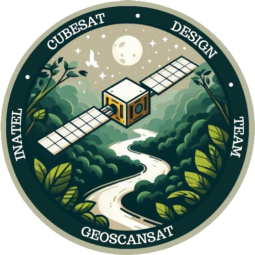
    </a>
    

        <h3>GeoScanSat &nbsp; 
    </h3>
        
📍 LASC 2025

        
A missão GeoScanSat visa detectar garimpo ilegal com um CubeSat que imageia áreas afetadas, coletando dados de Módulos Sensoriais sobre qualidade da água e ar, transmitindo informações para análise.

        

            <!-- Lara Conte -->
            <a align="right" href="https://github.com/lara-conte-gomes">
                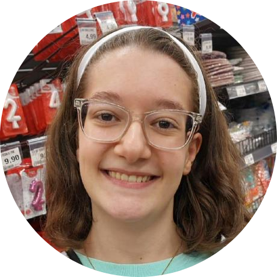
            </a>
            &nbsp;
            <!-- Matheus Renó -->
            <a align="right" href="https://github.com/RennowT">
                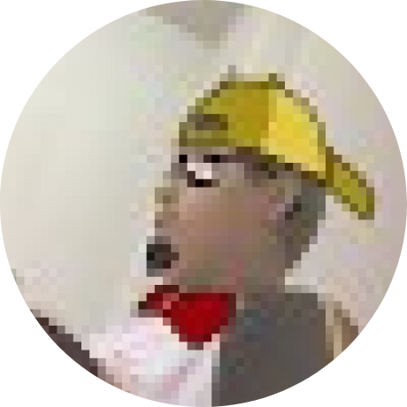
            </a>
            &nbsp;
            <!-- Diego Anestor -->
            <a align="right" href="https://github.com/DIEGOVZK">
                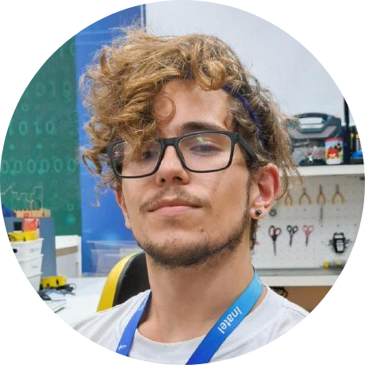
            </a>
            &nbsp;
            <!-- Rodrigo Andrade -->
            
            &nbsp;
            <!-- Lívia Cecília -->
            <a align="right" href="https://github.com/liviaceciliags">
                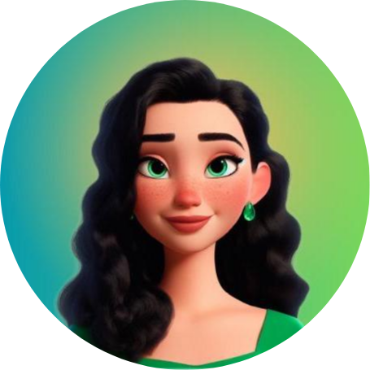
            </a>
            &nbsp;
            <!-- Gustavo Pivoto -->
            
        

    

 

<!-- Karawara-->

    <a href="https://github.com/ICDT-Inatel-Cubesat-Design-Team/Karawara">
        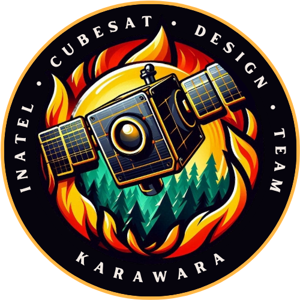
    </a>
    

        <h3>Karawara &nbsp; 
    </h3>
        
📍 OBSAT 2025

        
A missão Karawara usa um CubeSat para monitorar incêndios florestais em áreas remotas. Com uma câmera e inteligência artificial, o satélite detecta focos de incêndio e estima áreas queimadas.

        

            <!-- Rodrigo Andrade -->
            
            &nbsp;
            <!-- Allisson Machado -->
            <a href="https://github.com/AllissonMAndrade">
                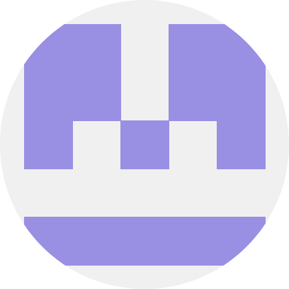
            </a>
            &nbsp;
            <!-- Álvaro Careli -->
            <a href="https://github.com/alvarosamp">
                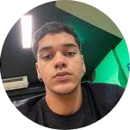
            </a>
        

    

<!-- WanderLust -->

    <a href="https://github.com/ICDT-Inatel-Cubesat-Design-Team/WanderLust">
        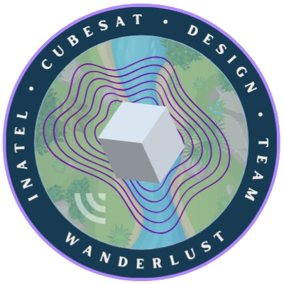
    </a>
    

        <h3>WanderLust &nbsp; 
    </h3>
        
📍 OBSAT 2025

        
A missão WanderLust visa monitorar rios e corpos d'água para prever inundações. Um CubeSat com uma câmera infravermelha captura imagens que mostram variações na extensão da água.

        

            <!-- Júlio César -->
            
            &nbsp;
            <!-- Rodrigo Andrade -->
            
            &nbsp;
            <!-- Allisson Machado -->
            
        

    

<!-- Lorentz’s Cage -->

    
    

        <h3>Lorentz’s Cage &nbsp; 
    </h3>
        
📍 OBSAT 2022 • 🥇 1º Lugar

        
A missão Lorentz's Cage testa o uso de cabos eletrodinâmicos em CubeSats para gerar energia elétrica aproveitando o campo magnético e o potencial eletrostático da Terra. O sistema gerou 1,3 V/m a 12 km de altitude, validando sua aplicação em missões espaciais.

        

            <!-- Diego Anestor -->
            
            &nbsp;
            <!-- Matheus Renó -->
            
        

    

<!-- Eremita -->

    <a href="https://github.com/ICDT-Inatel-Cubesat-Design-Team/Eremita">
        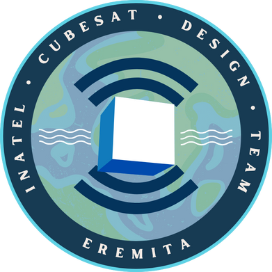
    </a>
    

        <h3>Eremita</h3>
        
📍 OBSAT 2022 • 🥉 3º Lugar

        
O CubeSat Eremita atua como repetidor para conectar sensores em florestas remotas a servidores via protocolo LoRa, coletando dados como temperatura, umidade e concentração de dióxido de carbono.

        

            <!-- Arielli Ajudarte -->
            <a align="right" href="https://github.com/ari-aju">
                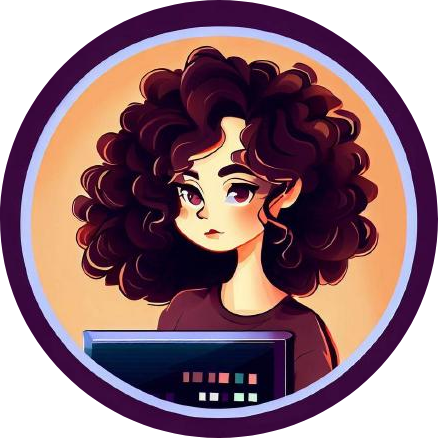
            </a>
            &nbsp;
            <!-- Lívia Cecília -->
            
            &nbsp;
            <!-- Gustavo Pivoto -->
            
        

    

<!-- Priceless -->

    <a href="https://www.researchgate.net/publication/369115635_Design_Prototyping_and_Stratospheric_Launch_of_CubeSats_for_University_Competition">
        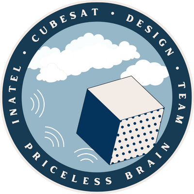
    </a>
    

        <h3>Priceless</h3>
        
📍 OBSAT 2021 • 🥇 1º Lugar

        
A missão Priceless utiliza um nanossatélite para conectar dispositivos IoT em áreas remotas. Equipado com tecnologia LoRa, o satélite atua como repetidor, viabilizando a transmissão de dados entre sensores remotos e estações terrenas.

        

            <!-- Arielli Ajudarte -->
            
            &nbsp;
            <!-- Diego Anestor -->
            
        

    

<!-- Alphasat -->

    <a href="https://www.researchgate.net/publication/364181892_Desenvolvimento_de_um_CubeSat_para_Mapeamento_de_Radiacao_Gama_em_Orbita_Baixa">
        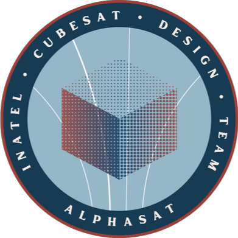
    </a>
    

        <h3>Alphasat</h3>
        
📍 OBSAT 2021 • 🥉 3º Lugar

        
O Alphasat foi desenvolvido para medir níveis de radiação gama em órbita baixa, associando os dados à localização geográfica. O objetivo é criar um mapa de calor público para auxiliar pesquisadores no desenvolvimento de proteções contra radiação em satélites.

        

            <!-- Diego Anestor -->
            
            &nbsp;
             <!-- Arielli Ajudarte -->
            
        

    

 

<!-- Participe -->

    <h2>
    &nbsp;&nbsp;Participe
  </h2>

 Quer participar da equipe? Envie um email para <a href="mailto:csi-adm@inatel.br">csi-adm@inatel.br</a> com seu currículo em anexo, iremos entrar em contato com você durante o período de prospecção de novos membros!
 

 

<!-- Footer -->

    Feito com  por <a href="https://github.com/RodrigoCAndrade">Rodrigo Andrade</a>
  

