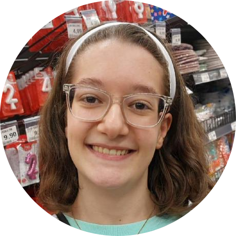
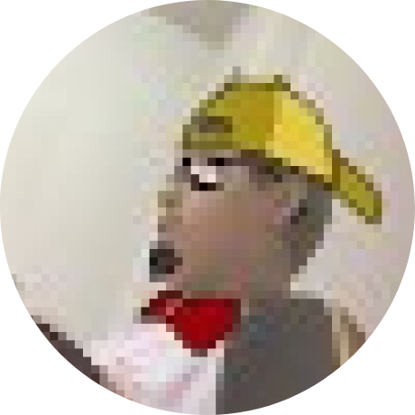
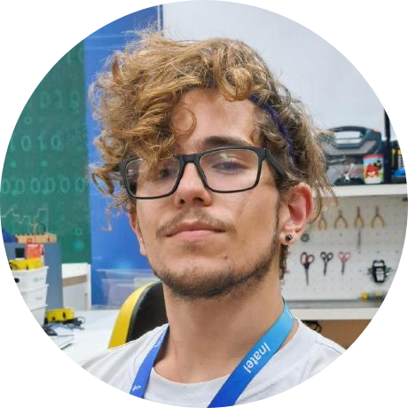
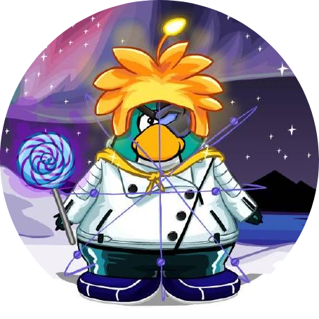
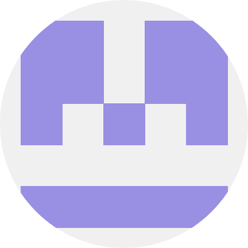
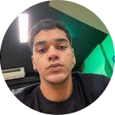
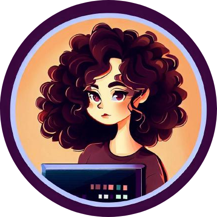
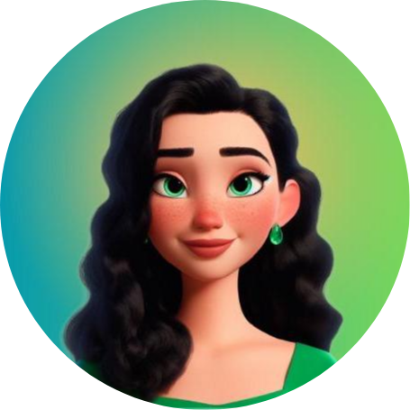

    
     
     
    <h1>Inatel CubeSat Design Team</h1>

O Inatel CubeSat Design Team (ICDT), fundado em 2020 no Laboratório de Cyber Segurança e Internet das Coisas (CS&I Lab) do Instituto Nacional de Telecomunicações (Inatel), tem como missão desenvolver e promover a pesquisa de pequenos satélites, como CubeSats e CanSats, capacitando alunos de graduação a se tornarem protagonistas no setor aeroespacial brasileiro por meio do desenvolvimento de tecnologias de ponta. O grupo participa de competições e congressos nacionais e internacionais, representando a instituição e contribuindo para o avanço das tecnologias aeroespaciais. Além disso, busca engajar escolas de ensino médio e técnico locais por meio de projetos de extensão educacional, promovendo o interesse pela ciência e tecnologia e formando uma nova geração de exploradores e cientistas.

<!-- Missões -->

    <h2>
    &nbsp;&nbsp;Missões
  </h2>

<!-- LASC 2025-->

    
    

        <h3>GeoScanSat &nbsp; 
    </h3>
        
📍 LASC 2025

        
[...]

        

            <!-- Lara Conte -->
            
            &nbsp;
            <!-- Matheus Renó -->
            
            &nbsp;
            <!-- Diego Anestor -->
            
            &nbsp;
            <!-- Rodrigo Andrade -->
            
        

    

 

<!-- Karawara-->

    
    

        <h3>Karawara &nbsp; 
    </h3>
        
📍 OBSAT 2025

        
A missão Karawara usa um CubeSat para monitorar incêndios florestais em áreas remotas. Com uma câmera e inteligência artificial, o satélite detecta focos de incêndio e estima áreas queimadas. Essa solução de baixo custo visa melhorar os sistemas de monitoramento e predição de queimadas, contribuindo para o desenvolvimento do setor aeroespacial.

        

            <!-- Rodrigo Andrade -->
            
            &nbsp;
            <!-- Allisson Machado -->
            
            &nbsp;
            <!-- Álvaro Careli -->
            
        

    

<!-- WanderLust -->

    
    

        <h3>WanderLust &nbsp; 
    </h3>
        
📍 OBSAT 2025

        
A missão WanderLust visa monitorar rios e corpos d'água para prever inundações. Um CubeSat com uma câmera infravermelha captura imagens que mostram variações na extensão da água. Os dados são processados no satélite e enviados à Terra, auxiliando na identificação de mudanças nos cursos d'água.

        

            <!-- José Eduardo -->
            
            &nbsp;
            <!-- Rodrigo Andrade -->
            
            &nbsp;
            <!-- Allisson Machado -->
            
        

    

<!-- Lorentz’s Cage -->

    
    

        <h3>Lorentz’s Cage &nbsp; 
    </h3>
        
📍 OBSAT 2022 • 🥇 1º Lugar

        
A missão Lorentz's Cage testa o uso de cabos eletrodinâmicos em CubeSats para gerar energia elétrica aproveitando o campo magnético e o potencial eletrostático da Terra. Em um voo de balão estratosférico, o sistema gerou 1,3 V/m a 12 km de altitude, validando sua aplicação para futuras missões espaciais.

        

            <!-- Diego Anestor -->
            
            &nbsp;
            <!-- Matheus Renó -->
            
        

    

<!-- Eremita -->

    
    

        <h3>Eremita</h3>
        
📍 OBSAT 2022 • 🥉 3º Lugar

        
O CubeSat Eremita atua como repetidor para conectar sensores em florestas remotas a servidores via protocolo LoRa, coletando dados como temperatura, umidade e concentração de dióxido de carbono. Testado em solo, ele demonstrou viabilidade para monitoramento ambiental em áreas de difícil acesso.

        

            <!-- Arielli Ajudarte -->
            
            &nbsp;
            <!-- Lívia Cecília -->
            
            &nbsp;
            <!-- Gustavo Pivoto -->
            
        

    

<!-- Priceless -->

    
    

        <h3>Priceless</h3>
        
📍 OBSAT 2021 • 🥇 1º Lugar

        
A missão Priceless utiliza um nanossatélite para conectar dispositivos IoT em áreas remotas, onde redes terrestres são escassas ou inexistentes. Equipado com tecnologia LoRa, o satélite atua como repetidor, viabilizando a transmissão de dados entre sensores remotos e estações terrenas.

        

            <!-- Arielli Ajudarte -->
            
            &nbsp;
            <!-- Diego Anestor -->
            
        

    

<!-- Alphasat -->

    
    

        <h3>Alphasat</h3>
        
📍 OBSAT 2021 • 🥉 3º Lugar

        
O Alphasat foi desenvolvido para medir níveis de radiação gama em órbita baixa, associando os dados à localização geográfica. O objetivo é criar um mapa de calor público para auxiliar pesquisadores no desenvolvimento de proteções contra radiação em satélites.

        

            <!-- Diego Anestor -->
            
            &nbsp;
             <!-- Arielli Ajudarte -->
            
        

    

<!-- Participe -->

    <h2>
    &nbsp;&nbsp;Participe
  </h2>

 Quer participar da equipe? Envie um email para <a href="mailto:csi-adm@inatel.br">csi-adm@inatel.br</a> com seu currículo em anexo, iremos entrar em contato com você durante o período de prospecção de novos membros!
 

 

<!-- Footer -->

    Feito com  por <a href="https://github.com/RodrigoCAndrade">Rodrigo Andrade</a>
  

